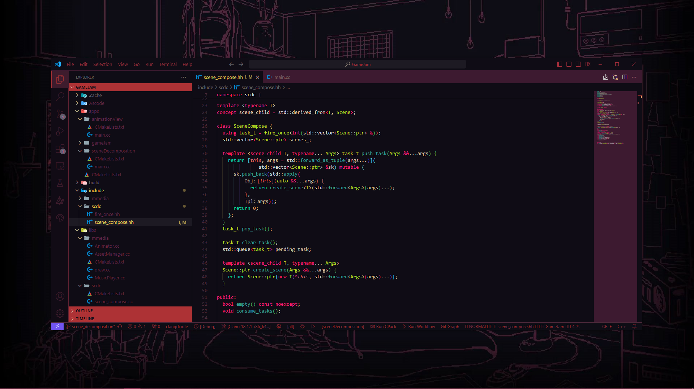

<h1 align="center">
   
  
   
  Milky theme
   
</h1>

<h4 align="center">Milk inside VS code inside VS code...</h4>

## Screenshots

## Installation
This extension is available for free in the [Visual Studio Code Marketplace](https://marketplace.visualstudio.com)
## Licencse
This theme is released under the MIT License.

Designed by [@NaumiKD](https://t.me/NaumiK8) (Telegram)
